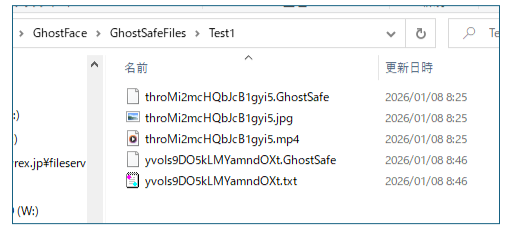
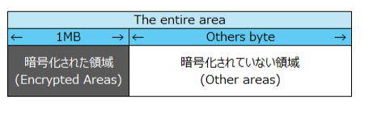

# GhostSafe 暗号化の仕組み  

## 1. 暗号化の方式  
暗号化されたファイルは、動画ファイルとそれ以外のファイルで作成される暗号化ファイル数が異なります  

### 動画ファイルの場合  
ファイル名を暗号化したファイル：ランダムな英数字20桁+.GhostSafe  
動画ファイルのサムネイルを暗号化したファイル：ランダムな英数字20桁+.jpg  
動画ファイルを暗号化したファイル：ランダムな英数字20桁+.動画の拡張子  

### 上記以外のファイルの場合  
ファイル名を暗号化したファイル：ランダムな英数字20桁+.GhostSafe  
ファイルを暗号化したファイル：ランダムな英数字20桁+.対象ファイルの拡張子  

  

※動画ファイルの例：throMi2mcHQbJcB1gyi5+α  
動画以外のファイルの例：yvoIs9DO5kLMYamndOXt+α  

## 2. 暗号化の領域  
デフォルトでは、対象ファイルの先頭 1MB のみを暗号化している  
対象ファイルが 1MB 未満の場合は、すべて暗号化される  
暗号化された領域が長いほど、セキュリティは高まるが複合化に時間を要する  
暗号化された領域の長さは変更できる  

  

## 3. 暗号化の領域の長さを変更する方法  
EncryptorAesGcm クラスの以下のメソッドの 1024 パラメータの数値を変更してください  
・ProtectFile  
・UnprotectFile  
・ProtectText  
