# インストール＆アンインストール

**インストール方法**  
GhostSafe.zip をダウンロードしたら解凍します。  
解凍した「win-x64」フォルダーにある GhostSafe.exe をダブルクリックしてください。  
あなたのパソコンに Microsoft .Net8ランタイムがインストールされていない場合には、以下のいずれかのメッセージが表示されます。

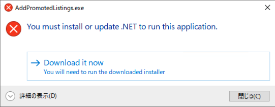

###メッセージ画像を追加する

「Download it now」をクリックしてインストールを開始してください。

**アンインストール方法**  
GhostSafe.zip を解凍したフォルダを削除してください。  
レジストリには何も登録していませんので削除する必要はありません。

また、暗号化フォルダーについて必要がない場合は削除してください。  
（※初期設定参照）

一時ファイルを削除するため、以下の文字列をコピーしてエクスブローラーに貼り付けて Enter を押してください。  
%localappdata%

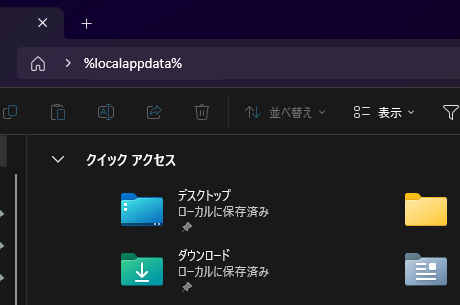

ここにある「GhostSafe」フォルダを削除してください。  
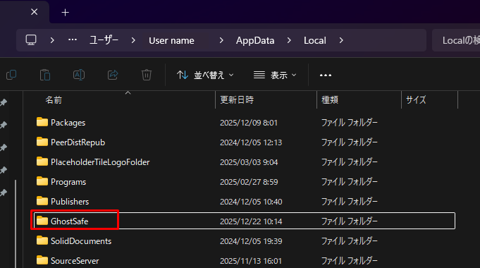

アンインストールは以上です。

# 初期設定

**初期設定**  
解凍したファイルのGhostSafeフォルダの下に"GhostSafe.exe"があるので、これをダブルクリックすると下記の画面が表示されます。

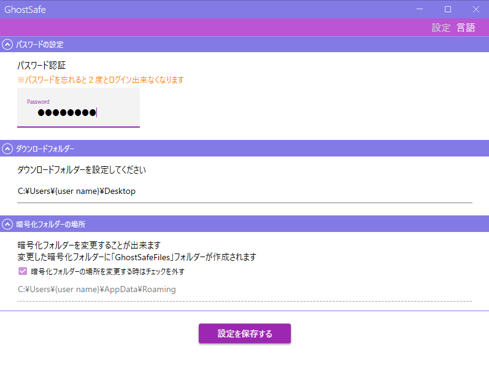
 
**パスワードの設定**  
英数字４桁以上でパスワードを設定します。  
このパスワードは２度と変更できませんので、忘れないようにしてください。

**ダウンロードフォルダーの設定**  
初期表示ではデスクトップに設定されていますが、随時変更することが出来ます。

**暗号化フォルダーの場所の設定**  
初期値では"C\\Users\\{User name\]}\\AppData\\Roming"の配下に作られます。  
暗号化フォルダーを外付けのHDDやSSD、ネットワークフォルダーに変更することも可能です。  
そうすることで、他のPCからもアクセスしやすくなります。  
後から変更することも可能ですが、その際は、旧暗号化フォルダーにあるファイルは、新暗号化フォルダーに自ら移動する必要があります。  

**設定を保存する**  
上記の３つの設定が終わったら、「設定を保存する」をクリックします。  
すると下記のメッセージが表示されます。  
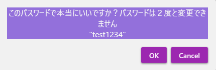  

設定したパスワードが表示されますので、これで良ければ「OK」をクリックします。  
正しく保存されると下記のメッセージが表示されます。  
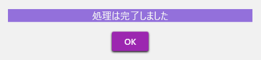

「OK」をクリックするとメイン画面が表示されます。  
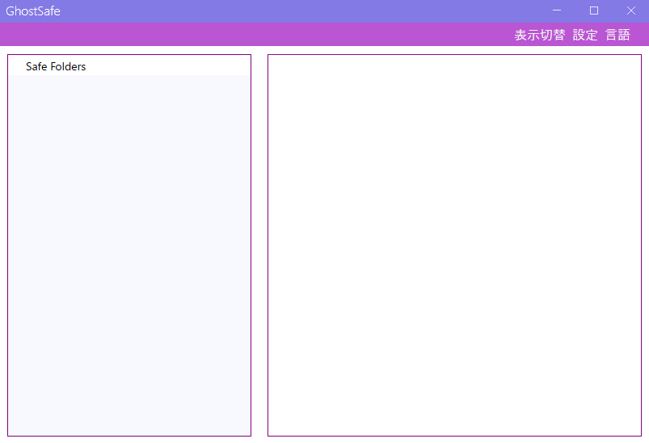

# フォルダの作成

**フォルダの作成、変更、削除**  
必要な場合、フォルダを作成できます。  
"Safe Folders"を右クリックすると以下のメニューが表示されます。  
「フォルダー作成」をクリックします。  
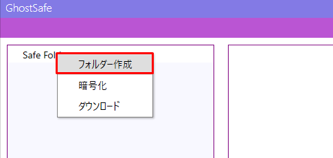

フォルダー名を入力します。  
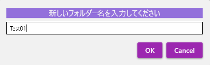

フォルダーが作成されました。  
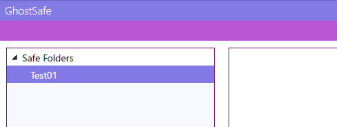

フォルダー名の変更やフォルダーの削除は、以下のメニューから同様に可能です。  
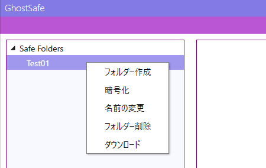

# ファイルの暗号化

**ファイルの暗号化**  
ファイルを暗号化するには、フォルダー名を右クリックして「暗号化」をクリックします。  
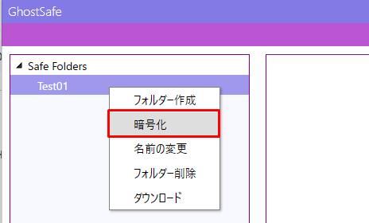

紫の画面が表示されたら、暗号化したいファイル、またはフォルダーをドラッグ＆ドロップします。（※フォルダをドラッグ＆ドロップした場合は、配下のファイルやフォルダーもまとめて暗号化します）  
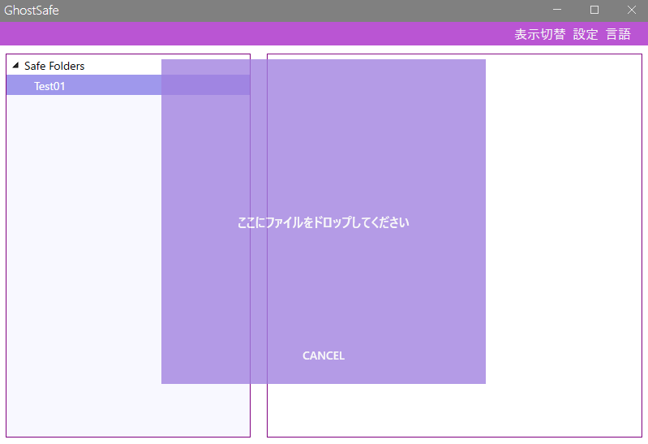

以下のメッセージが表示されます。  
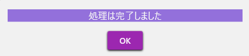

暗号化されたファイルが表示されます。  
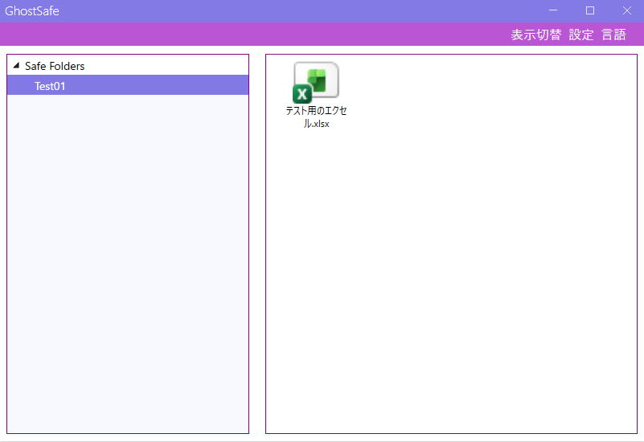

# ファイル名の変更

**ファイル名の変更や削除**  
フォルダと同様にファイル名の変更や削除も行えます。  
ファイルのアイコンを右クリックしてメニューから操作します。  
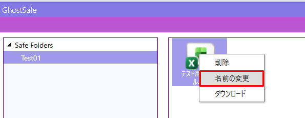

変更したい名前を入力して「OK」をクリックします。  
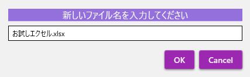

ファイル名が変更されました。  
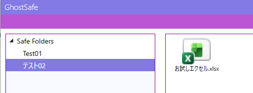

※ファイルの削除も同様に行うことができます。

# ファイルの移動

**ファイルの移動**  
ファイルをドラッグ＆ドロップして他のフォルダに移動することができます。  
※この例では「テスト02」フォルダに向かってドラッグ＆ドロップしています  
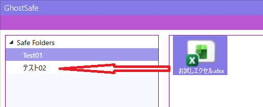

ファイルが移動されました。  

なお、ファイルの移動はひとつずつしかできません。

複数ファイルを移動したい場合は、フォルダーをダウンロードしてから  
暗号が解かれたファイルをまとめて暗号化してください。

# ファイルのダウンロード

**ファイルのダウンロード**  
ファイルを右クリックして「ダウンロード」をクリックします。  
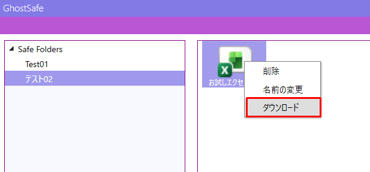

「OK」をクリックします。  

設定メニューで指定したフォルダに解凍したファイルがダウンロードされます。

なお、ファイルのダウンロードは、ひとつずつしかできません。  
複数ファイルをダウンロードしたい場合は、フォルダを右クリックして「ダウンロード」をクリックしてください。  
フォルダー配下のファイルをすべてダウンロード出来ます。  
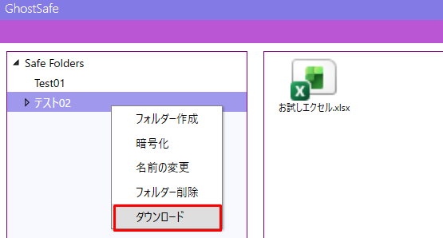

# 動画ファイルの再生

**動画ファイルの再生**  
動画ファイルをダブルクリックすると、再生用ウィンドウが起動します。  
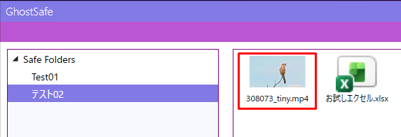

上記の赤枠はmp4ファイルの動画ファイルです。  
こちらをダブルクリックすると下記の再生用ウィンドウが起動します。

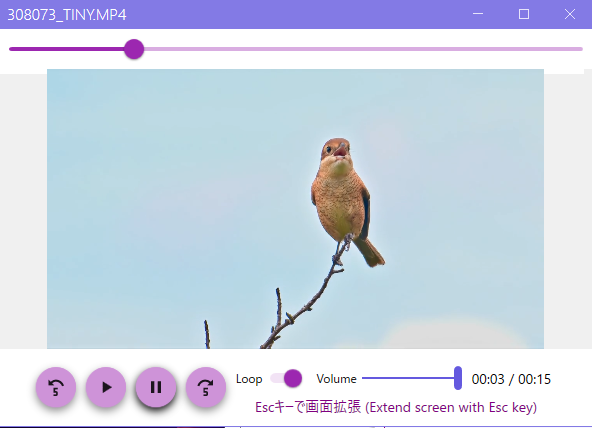  
※Video created by Kaneori  
    [https://pixabay.com/ja/users/kanenori-4749850/](https://pixabay.com/ja/users/kanenori-4749850/)

Loop : チェックすると動画を終了しないでループして再生を繰り返します  
Volume : 音量調整委です  
Esc key : Escキーを押下するたびに画面の大きさを変更できます  

対応する拡張子は以下のとおりです。  
動画：MP4, MKV, AVI, MOV, MPEG, WMV, FLV, WebM, 3GP, M4V, ASF, MKV  
音声：MP3, AAC, WAV, FLAC, OGG, WMA, M4A  

上記の拡張子が必ずしも再生可能であるとは言えません。  
お使いのコンピューターのコーデックの有無により再生できないこともあります。

Windows 10 のコーデックの確認は以下を参考にしてください。  
https://faq.nec-lavie.jp/fa/qa/web/knowledge20351.html  

Windows 11 のコーデックの確認は以下を参考にしてください。  
https://faq.nec-lavie.jp/fa/qa/web/knowledge24601.html  

# 静止画像の表示

**静止画像の表示**  
静止画像のファイルをダブルクリックします。  
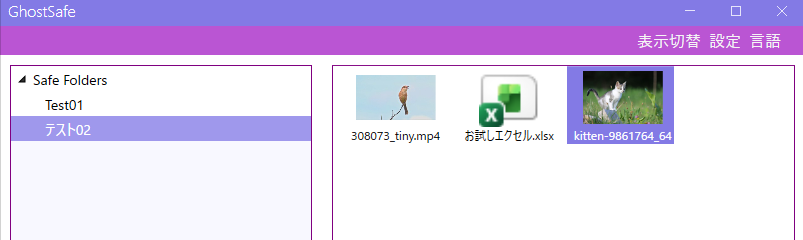

静止画像のウィンドウが表示されます。  
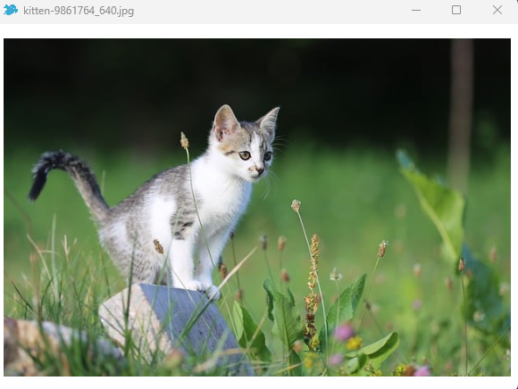  
tajtijozsi  
[https://pixabay.com/ja/users/tajtijozsi-23958236/](https://pixabay.com/ja/users/tajtijozsi-23958236/)

# ファイル更新時の暗号化

**ファイル更新時の暗号化**  
エクセルファイルやテキストファイルなど、更新した結果を自動で暗号化する方法は下記になります。  
目的のファイルをダブルクリックして開きます。  
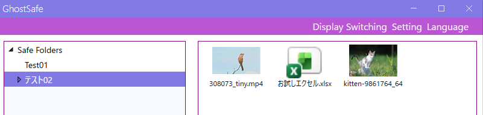

更新前のExcelの状態です  
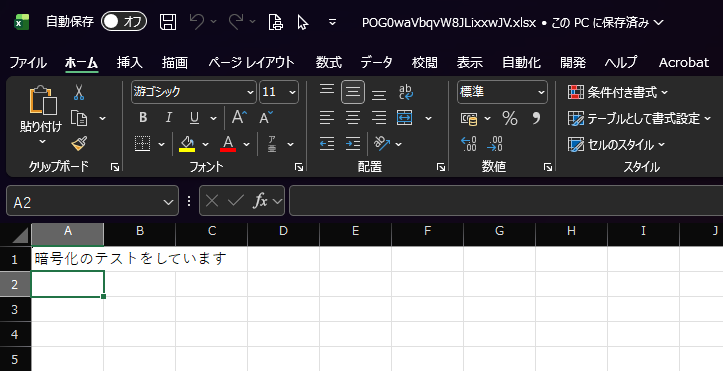

テキストを追記して更新ボタンをクリックします。  
※赤枠に「このPCに保存済み」と表示されました  
（※Windows 11 によりMicrosoft 365 を使用している例です）

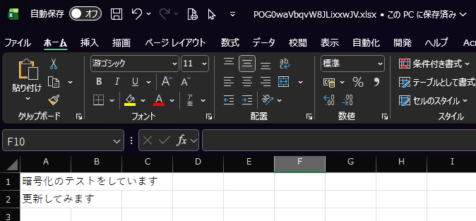

メイン画面の✖マークをクリックして GhostSafe を終了します。  
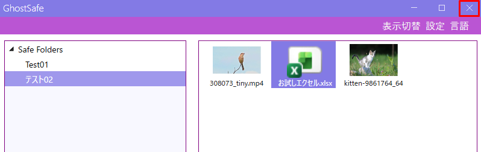

更新されたファイルがあると以下のメッセージが表示されます。  
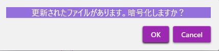

「OK」をクリックすると GhostSafe は終了します。

確認のために再度、GhostSafe を起動して同ファイルをダブルクリックします。

更新されていることが確認できます。  
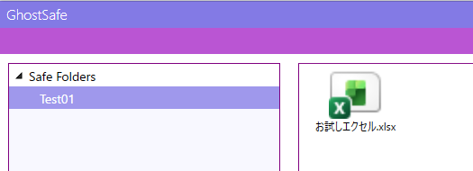

注意事項として、GhostSafe を終了する前に各ファイルは保存されている必要があります。  
保存せずにファイルを開いたままの場合は、暗号化されませんのでご注意ください。

# 表示切替

**表示切替**  
暗号化したファイルの表示を切り替えることが出来ます。  
「表示切替」で「Details」をクリックします  
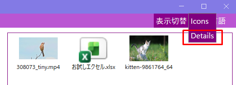

更新日時、種類、サイズが表示される形式に変更されます。  
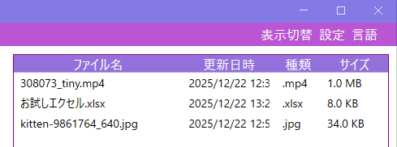

# 設定

「設定」をクリックするとダウンロードフォルダーや暗号化フォルダーを変更することが出来ます。  
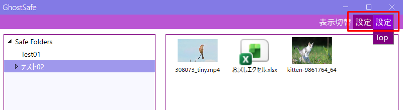  

「設定」をクリックします  
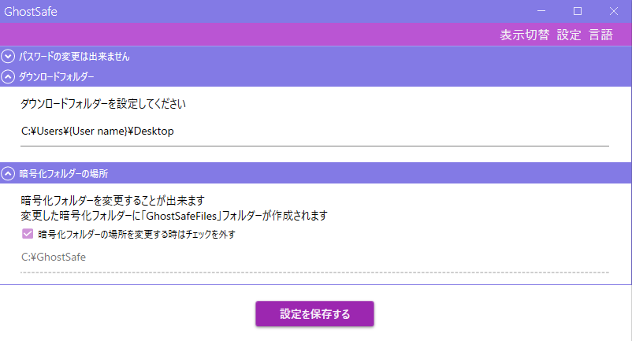  
※「設定 → Top」をクリックするとメイン画面を表示します。

# 言語切替

**言語の切替**  
言語を英語に切り替えて使用することが出来ます。  
「言語 → English」をクリックします。  
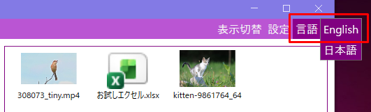

英語に切り替えました。  

# 複数のPCでGhostSafeを使うとき

**複数のPCで GhostSafe を使いたいとき**  
PCを買い換えて暗号化データを引越ししたいときにも、この方法が使えます。  
メニューの「設定 → 設定」から暗号化フォルダーの場所を変更します。  
変更するフォルダーは、ネットワーク上ドライブやUSBドライブ、若しくはSSDドライブを用意してご利用ください。  

なお、サーバー上にあるネットワークフォルダーなどを指定する際は、U:ドライブなどと指定せず、サーバー名を指定してご利用いただくとドライブ接続が安定します。  

（例）ドライブ指定の方法  
NG：U:/暗号化フォルダ  
OK：//xserver/暗号化フォルダ  
